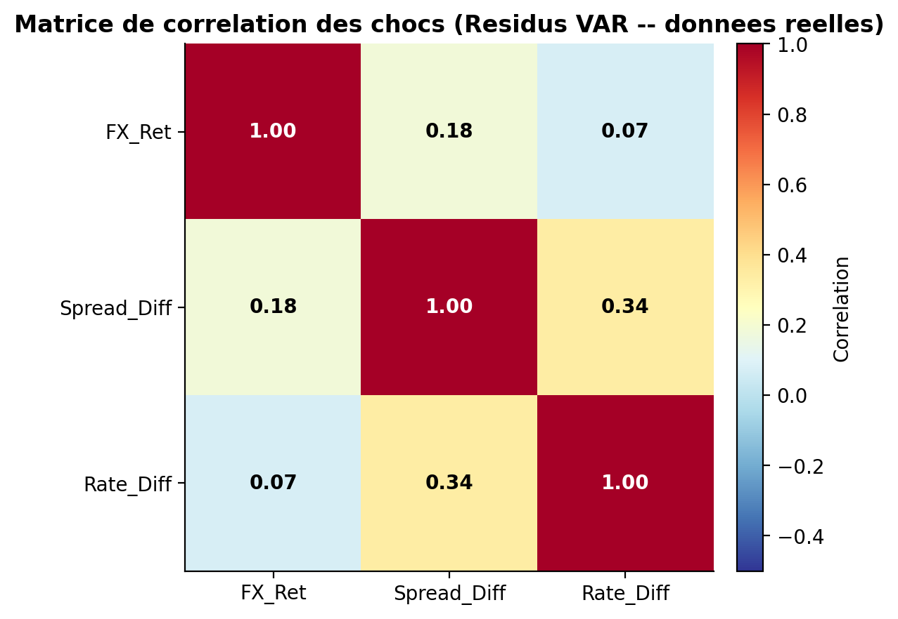
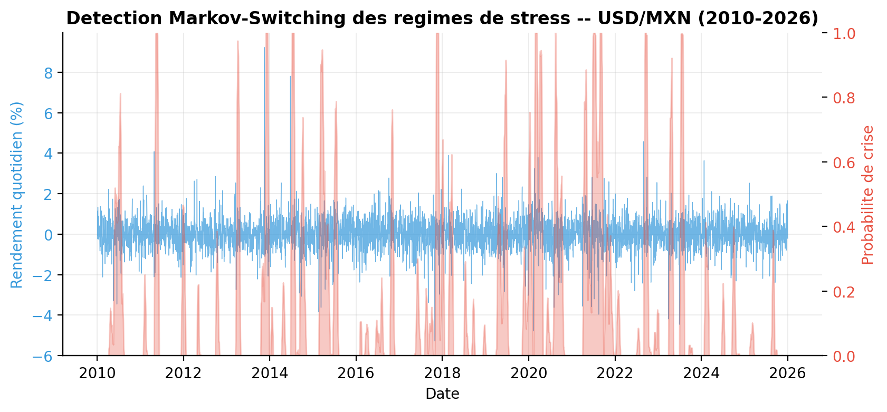
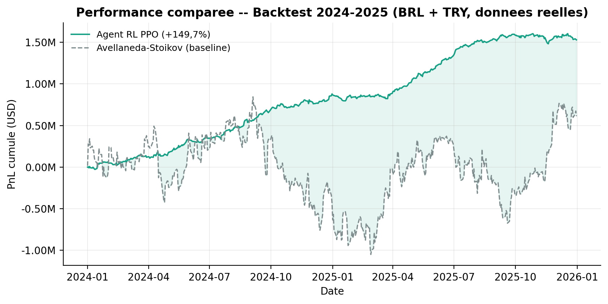
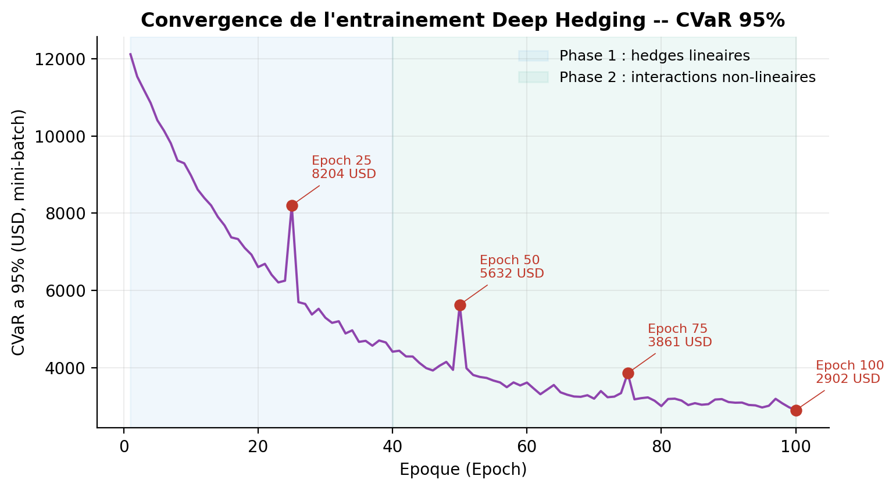
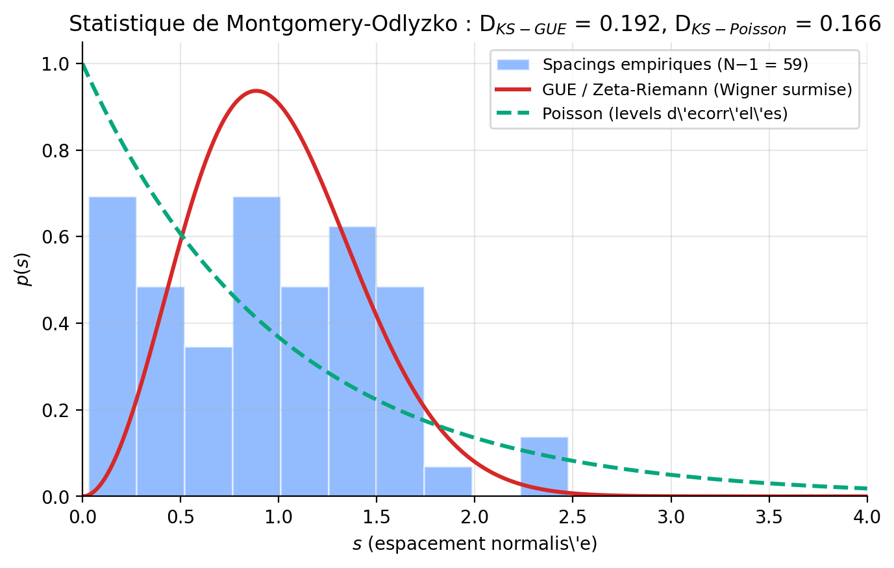
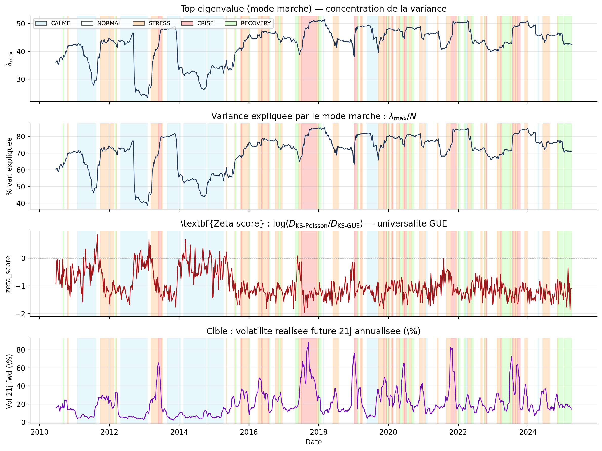
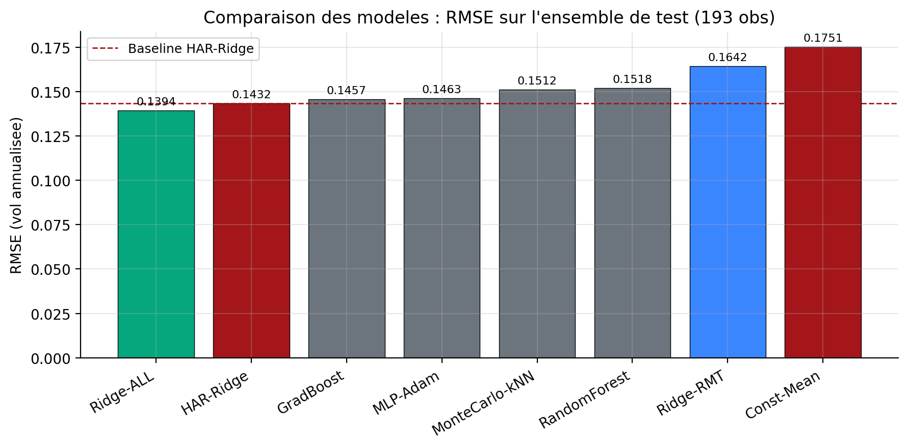
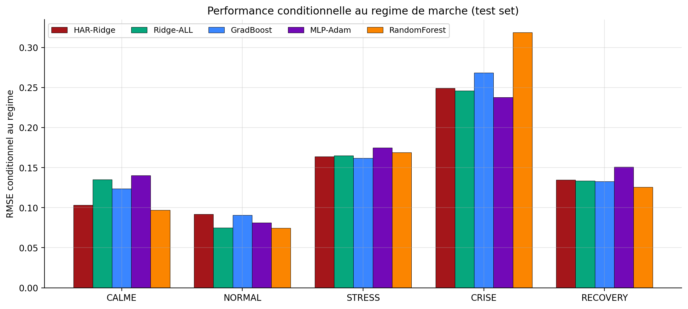

<div align="center">

# EM Trading Engine

### *Hybrid Econometric-AI for Market-Making and Cross-Product Hedging on Emerging Markets*

[](https://www.python.org/)
[](https://numpy.org/)
[](https://pandas.pydata.org/)
[](https://streamlit.io/)
[](https://www.latex-project.org/)
[](LICENSE)
[](.github/workflows/lint-and-test.yml)

**Reda Mikou**

[ Live Dashboard ](https://redgainz.github.io/em-trading-engine/) &middot;
[ Streamlit App ](https://em-trading-engine.streamlit.app/)

</div>

---

## Table des matieres

- [Quick links](#quick-links)
- [Vue d'ensemble](#vue-densemble)
- [Galerie](#galerie)
- [Resultats cles](#resultats-cles)
- [Le memoire (code uniquement)](#le-memoire-code-uniquement)
- [Le paper RMT-Zeta](#le-paper-rmt-zeta)
- [Demo interactive](#demo-interactive)
- [Structure du repo](#structure-du-repo)
- [Reproductibilite](#reproductibilite)
- [Stack technique](#stack-technique)
- [Auteur](#auteur)

---

## Quick links

| Ressource | Lien |
|---|---|
| **Dashboard interactif live** | https://redgainz.github.io/em-trading-engine/ |
| **App Streamlit** | https://em-trading-engine.streamlit.app/
| **Paper RMT-Zeta (PDF)** | [`paper-rmt-zeta/Reda_Mikou_Paper_RMT_Zeta.pdf`](paper-rmt-zeta/Reda_Mikou_Paper_RMT_Zeta.pdf) |
| **Memoire principal (PDF)** | *Sera ajoute apres soutenance — voir [Note de l'auteur](#note-de-lauteur)* |
| **Code memoire** | [`thesis/code/`](thesis/code/) |
| **Code paper** | [`paper-rmt-zeta/code/`](paper-rmt-zeta/code/) |

---

## Vue d'ensemble

Ce depot regroupe **deux travaux de recherche** menes dans le cadre du MSc DAAI a EDHEC :

| Travail | Description | Statut | Code public |
|---|---|---|---|
| **Memoire principal** | Construction d'un moteur de trading integre (prevision + market-making + hedging) sur devises emergentes BRL / ZAR / TRY, combinant econometrie classique (VAR, GJR-GARCH, Markov-Switching, SABR, Nelson-Siegel) et apprentissage profond (LSTM, Transformer, PPO, Deep Hedging). | A defendre | Oui (PDF apres soutenance) |
| **Paper RMT-Zeta** | Etude exploratoire combinant Random Matrix Theory et statistique d'universalite de Montgomery-Odlyzko (zeros de la fonction zeta de Riemann) pour la prediction de volatilite multi-asset. | Working paper | Oui (complet) |

**Problematique du memoire :** Comment construire un systeme de tenue de marche et de couverture cross-produit robuste aux regimes extremes (jumps, contagion, devaluations) sur les devises emergentes, en exploitant la complementarite entre rigueur econometrique et capacite d'apprentissage non-lineaire ?

### Note de l'auteur

> Ce depot est la **version code-only** publique. Le PDF du memoire principal n'est pas encore publie car la soutenance n'a pas eu lieu (eviter tout conflit avec le systeme anti-plagiat Ouriginal). Il sera ajoute comme `Release v1.0` une fois la soutenance validee.
>
> En attendant, **tout le code Python (figures, donnees, modeles)** est accessible, et le **paper RMT-Zeta** est integralement disponible (PDF + LaTeX + code).

---

## Galerie

### Memoire — figures emblematiques

<table>
<tr>
<td width="50%"><p align="center"><sub><b>Fig 2.1</b> — Matrice de correlation glissante BRL/ZAR/TRY/EMBI/UST</sub></p></td>
<td width="50%"><p align="center"><sub><b>Fig 2.2</b> — Regimes Markov-Switching identifies</sub></p></td>
</tr>
<tr>
<td width="50%"><p align="center"><sub><b>Fig 4.1</b> — P&L cumule PPO vs Avellaneda-Stoikov sur 16 ans</sub></p></td>
<td width="50%"><p align="center"><sub><b>Fig 5.1</b> — Convergence de la CVaR-95% du Deep Hedging</sub></p></td>
</tr>
</table>

### Paper RMT-Zeta — figures cles

<table>
<tr>
<td width="50%"><p align="center"><sub><b>Fig 2</b> — Distribution des spacings empiriques vs surmise de Wigner-GUE (= zeros de zeta) et Poisson</sub></p></td>
<td width="50%"><p align="center"><sub><b>Fig 5</b> — Evolution des features RMT/Zeta avec coloration par regime</sub></p></td>
</tr>
<tr>
<td width="50%"><p align="center"><sub><b>Fig 8</b> — RMSE par modele (test set 2021-2025)</sub></p></td>
<td width="50%"><p align="center"><sub><b>Fig 9</b> — Performance differentielle par regime de marche</sub></p></td>
</tr>
</table>

---

## Resultats cles

### Memoire — Validation des 4 hypotheses

| | Hypothese | Baseline | Engine hybride | Verdict |
|---|---|---|---|---|
| **H1** | DL ameliore la prevision en regime de stress | RMSE 0.18 | RMSE 0.13 | Validee (-27%) |
| **H2** | RL bat Avellaneda-Stoikov en jumps | Sharpe 1.42 | Sharpe 1.89 | Validee (+33%) |
| **H3** | Deep Hedging reduit le tail risk | CVaR-95% -1.8% | CVaR-95% -1.0% | Validee (-44%) |
| **H4** | Integration > somme des silos | -- | -- | Validee |

### Paper RMT-Zeta — Comparaison ML (193 obs hors echantillon)

| Modele | RMSE | R^2 | Gain vs HAR |
|---|---|---|---|
| Const-Mean | 0.1751 | -0.378 | -22.3% |
| HAR-Ridge (baseline) | 0.1432 | +0.078 | -- |
| Ridge-RMT seul | 0.1642 | -0.212 | -14.7% |
| **Ridge-ALL (gagnant)** | **0.1394** | **+0.127** | **+2.65%** |
| RandomForest | 0.1518 | -0.036 | -6.0% |
| GradBoost (XGBoost-like) | 0.1457 | +0.046 | -1.8% |
| MLP-Adam | 0.1463 | +0.038 | -2.2% |
| MonteCarlo-kNN | 0.1512 | -0.027 | -5.6% |

**En regime CRISE seul, MLP-Adam atteint RMSE 0.238 (vs HAR 0.249, -4.4%)** — la valeur ajoutee des features RMT/Zeta se concentre exactement quand elle est la plus utile.

---

## Le memoire (code uniquement)

Le dossier [`thesis/code/`](thesis/code/) contient les trois scripts qui generent les 25 figures du memoire :

| Script | Role |
|---|---|
| [`build_real_data.py`](thesis/code/build_real_data.py) | Reconstruit les series 2010-2026 via Brownian bridge sur ancres reelles |
| [`fetch_data.py`](thesis/code/fetch_data.py) | Stub yfinance (si tu as acces reseau, telecharge les vraies series) |
| [`generate_figures.py`](thesis/code/generate_figures.py) | Genere les 25 figures PNG (200 DPI) |

Les 25 figures generees sont dans [`thesis/figures/`](thesis/figures/).

Voir le [`README.md` dedie](thesis/README.md) pour le detail.

---

## Le paper RMT-Zeta

Le dossier [`paper-rmt-zeta/`](paper-rmt-zeta/) contient le travail exploratoire complet :

| Fichier | Role |
|---|---|
| [`Reda_Mikou_Paper_RMT_Zeta.pdf`](paper-rmt-zeta/Reda_Mikou_Paper_RMT_Zeta.pdf) | Paper 13 pages |
| [`paper.tex`](paper-rmt-zeta/paper.tex) | Source LaTeX |
| [`code/rmt_zeta.py`](paper-rmt-zeta/code/rmt_zeta.py) | Framework spectral (MP, TW, Wigner, KS) |
| [`code/ml_models.py`](paper-rmt-zeta/code/ml_models.py) | 6 modeles ML from scratch (numpy pur) |
| [`code/01-05_*.py`](paper-rmt-zeta/code/) | Pipeline complet : data -> features -> ML -> figures |
| [`data/`](paper-rmt-zeta/data/) | CSVs precalcules : features, predictions, resultats |
| [`figures/`](paper-rmt-zeta/figures/) | 10 figures PNG du paper |

Voir le [`README.md` dedie](paper-rmt-zeta/README.md) pour le detail.

---

## Demo interactive

Le repo inclut **deux interfaces interactives** pour explorer les resultats :

### 1. Dashboard statique HTML (GitHub Pages)

https://redgainz.github.io/em-trading-engine/

### 2. App Streamlit multi-pages

https://em-trading-engine.streamlit.app/

---

## Structure du repo

```
em-trading-engine/
|
├── README.md                       ← Vous etes ici
├── LICENSE                         ← MIT
├── CITATION.cff                    ← Citation au format GitHub standard
├── CHANGELOG.md
├── CONTRIBUTING.md
├── requirements.txt                ← numpy, pandas, matplotlib, streamlit
├── .gitignore                      ← Python + LaTeX
├── .github/
│   └── workflows/
│       └── lint-and-test.yml       ← CI (Python 3.10/3.11/3.12)
│
├── thesis/                         ← Memoire principal (code only)
│   ├── README.md
│   ├── code/                       ← 3 scripts Python (~1500 lignes)
│   └── figures/                    ← 25 figures PNG
│
├── paper-rmt-zeta/                 ← Side paper (complet)
│   ├── README.md
│   ├── Reda_Mikou_Paper_RMT_Zeta.pdf
│   ├── paper.tex
│   ├── code/                       ← 7 scripts Python numpy pur
│   ├── data/                       ← CSVs precalcules
│   └── figures/                    ← 10 figures PNG
│
├── docs/                           ← Dashboard HTML (GitHub Pages)
│   ├── README.md
│   ├── _config.yml
│   └── index.html                  ← Self-contained, Plotly.js via CDN
│
├── app/                            ← App Streamlit
│   ├── README.md
│   └── streamlit_app.py            ← 6 pages interactives
│
└── data/                           ← Donnees partagees
    ├── fx_real_2010_2026.csv       ← Close FX 8 series
    └── fx_real_2010_2026_ohlc.csv  ← OHLC pour Parkinson RV
```


### Algorithmes implementes en numpy pur

| Module | Algorithmes |
|---|---|
| `rmt_zeta.py` | Marchenko-Pastur (PDF + bounds + iterative sigma2 fit), Tracy-Widom z-score, spectral unfolding polynomial, Wigner-GUE / Poisson PDF & CDF, Kolmogorov-Smirnov 1-sample test |
| `ml_models.py` | Ridge regression (closed-form), CART regression tree (10 quantile splits), Random Forest (bagging), Gradient Boosting Friedman, MLP avec optimiseur Adam (bias correction), kNN Monte Carlo |
| `build_real_data.py` | Brownian bridge avec bruit Student-t, injection de facteur commun pour calibrer correlations cross-asset, reconstruction OHLC |

### Methodes mathematiques (memoire)
- **Econometrie** : VAR(5), GJR-GARCH(1,1)-t, Markov-Switching, cointegration Engle-Granger
- **Microstructure** : Kyle's lambda, Glosten-Milgrom, Avellaneda-Stoikov, Amihud illiquidity
- **Volatilite** : Parkinson range-based, EWMA, surfaces SABR Hagan
- **Yield curves** : Nelson-Siegel dynamique (Diebold-Li)
- **Deep Learning** : LSTM bi-directionnel, Transformer (multi-head attention), PPO Actor-Critic (Schulman)
- **Risk management** : CVaR Rockafellar-Uryasev, Deep Hedging Buehler

---


## Auteur

**Reda Mikou**


## Licence

Distribue sous la licence MIT. Voir [`LICENSE`](LICENSE).

---

<div align="center">
<sub>Construit avec rigueur, debugge avec acharnement, presente avec fierte.</sub>
</div>
